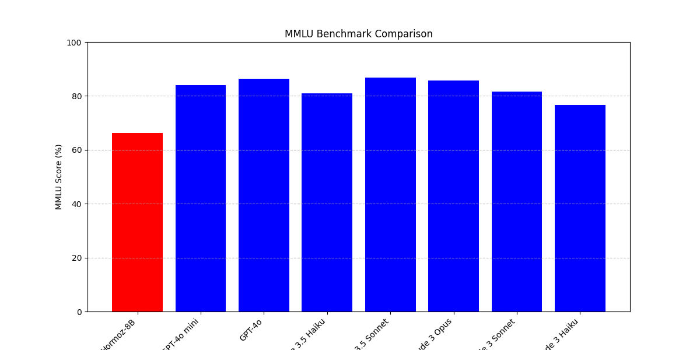

# Hormoz 8B

## Introduction

## Run on [Modal](https://modal.com)

First, you have to go to [modal](https://modal.com) and create an account. Then, you follow their instructions in order to sign your computer to their network and then, you have to follow the following instrcutions.

### Downloading Models

By doing this, you download models in your Modal storage. This means you easily can access model weights and the app doesn't need to download the model from HuggingFace. Remember to set _huggingface secret_ before running the model (although the model is free and not gated, the secret is added in codes. That's just my personal laziness.)

After you set up your account, just run the following code:

```
modal run modal/download_model.py
```

And wait until it downloads the model weights.

### Serving the model 

The only thing you need to do is running the following command:

```
modal serve modal/vllm_inference.py
```

_NOTE:_ Remember to change `my-secret-key` to a more secure API key. Specially if you're gonna use this model on production.

### Deploying the model

Just do this:

```
modal deploy modal/vllm_inference.py
```

## Run using `transformers`

```
pip install transformers --upgrade
```

_Note:_ For better performance, you may need to install `accelerate` package as well. 

### Inference 

```python
from transformers import AutoTokenizer, AutoModelForCausalLM

model_id = "mann-e/Hormoz-8B"
tokenizer = AutoTokenizer.from_pretrained(model_id)
model = AutoModelForCausalLM.from_pretrained(model_id).to("cuda")

messages = [{"role": "user", "content": "What is the answer to universe, life and everything?"}]
input_ids = tokenizer.apply_chat_template(messages, tokenize=True, add_generation_prompt=True, return_tensors="pt").to("cuda")

gen_tokens = model.generate(
    input_ids, 
    max_new_tokens=1024, 
    do_sample=True, 
    temperature=1.0,
    )

gen_text = tokenizer.decode(gen_tokens[0])
print(gen_text)
```

## Benchmarks

### MMLU 

#### Comparing with SoTA models

<p align="center">
    
</p>

#### Comparing with open source big models

<p align="center">
    
</p>

## License