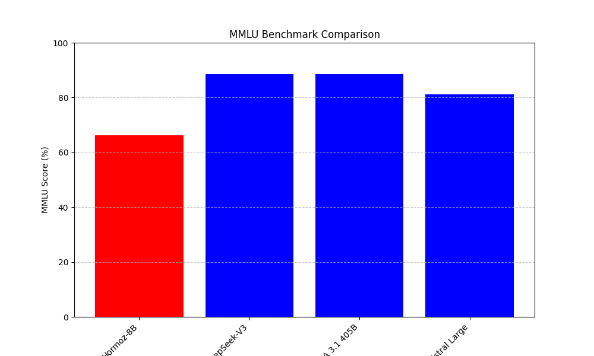

# Hormoz 8B

## Introduction

This model is an effort in order to make a multi-lingual and _on device_ models which can be executed on the consumer hardware. The model follows the steps used in training _DeepSeek_ model. However, the model is _not a reasoning model_ and a generic question answering, conversational and _uncensored_ model which has been made with a cost of around $4000 USD. 
 
 Also, this model is based on _Command R_'s architecture, since that architecture gave us the best results in multilingual chat. Specially with languages such as _Persian_ and _Arabic_. This way, you can consider this model like a commercially useaeble version of _aya expanse_ as well.

### The name

<p align="center">
  
</p>

The name __Hormoz__ comes from the Persian word "هرمز" which has multiple meanings. It can point to the _strait of Hormoz_ in Persian Gulf or _Hormoz Island_ which is part of the Hormozgan Province in the south of Iran. Also it may point to "اورمزد" or _Ourmozd_ which is middle/ancient Persian name for the planet _Jupiter_ and derived from the term _Ahura Mazda_ or the Avestan term for God. 

## Model Card

You can read [Model Card](./MODEL.md) or you can check the model on [Hugging Face](https://huggingface.co/mann-e/Hormoz-8B).

## Costs

| Cost | Price (US Dollars) |
|:--------------:|:--------:|
| RTX 4090 (x4)  | $1.5/hour |
| Storage        | $0.005/hour |
| Man Hour       | $20/hour 

We haven't added the cost of OpenAI API's (used for translating and generating the datasets) to the above list. 


## Run on [Modal](https://modal.com)

First, you have to go to [modal](https://modal.com) and create an account. Then, you follow their instructions in order to sign your computer to their network and then, you have to follow the following instructions.

### Downloading Models

By doing this, you download models in your Modal storage. This means you easily can access model weights and the app doesn't need to download the model from HuggingFace. Remember to set _huggingface secret_ before running the model (although the model is free and not gated, the secret is added in codes. That's just my personal laziness.)

After you set up your account, just run the following code:

```
modal run modal/download_model.py
```

And wait until it downloads the model weights.

### Serving the model 

The only thing you need to do is running the following command:

```
modal serve modal/vllm_inference.py
```

_NOTE:_ Remember to change `my-secret-key` to a more secure API key. Specially if you're gonna use this model on production.

### Deploying the model

Just do this:

```
modal deploy modal/vllm_inference.py
```

## Run using `transformers`

```
pip install transformers --upgrade
```

_Note:_ For better performance, you may need to install `accelerate` package as well. 

### Inference 

```python
from transformers import AutoTokenizer, AutoModelForCausalLM

model_id = "mann-e/Hormoz-8B"
tokenizer = AutoTokenizer.from_pretrained(model_id)
model = AutoModelForCausalLM.from_pretrained(model_id).to("cuda")

messages = [{"role": "user", "content": "What is the answer to universe, life and everything?"}]
input_ids = tokenizer.apply_chat_template(messages, tokenize=True, add_generation_prompt=True, return_tensors="pt").to("cuda")

gen_tokens = model.generate(
    input_ids, 
    max_new_tokens=1024, 
    do_sample=True, 
    temperature=1.0,
    )

gen_text = tokenizer.decode(gen_tokens[0])
print(gen_text)
```

## Benchmarks

### MMLU 

#### Comparing with SoTA models

<p align="center">
    
</p>

#### Comparing with open source big models

<p align="center">
    
</p>

### GSM8K

#### Comparing with SoTA models

<p align="center">
    
</p>

#### Comparing with open source models

<p align="center">
    
</p>

### Other Benchmarks

1. LAMBADA : `67.94`

## License

This model is published under _MIT_ license. 

### Commercial Use 

Since this model is MIT licensed, you're free to do whatever you want with the model. However since we're a relatively small startup, we recommend you if you are a big corporate and you host this model, give us a capacity of your API as well. This way, we both can benefit from the model. 

## Special Thanks

1. [Mani Mirzaei](https://huggingface.co/xmanii)
2. [Thomas from Pollinations AI](https://pollinations.ai)
